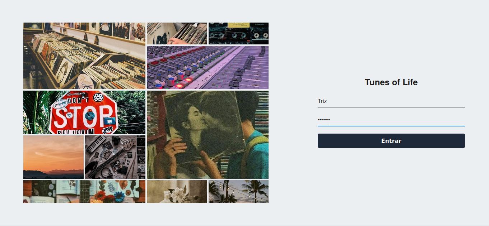
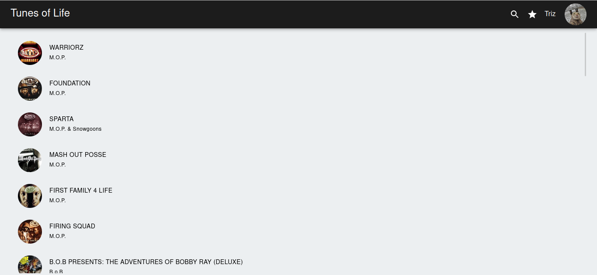
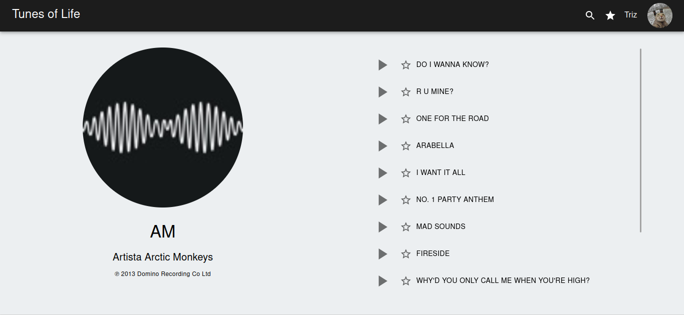
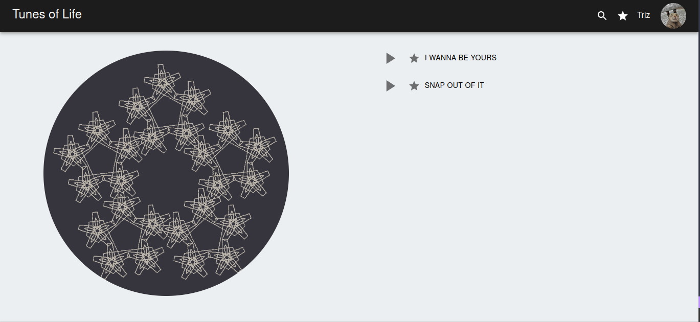
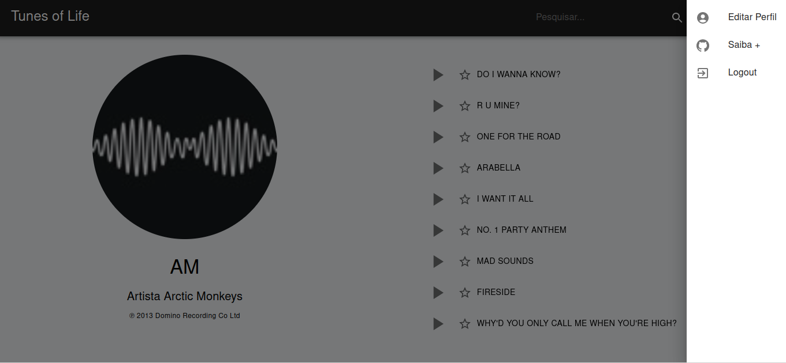
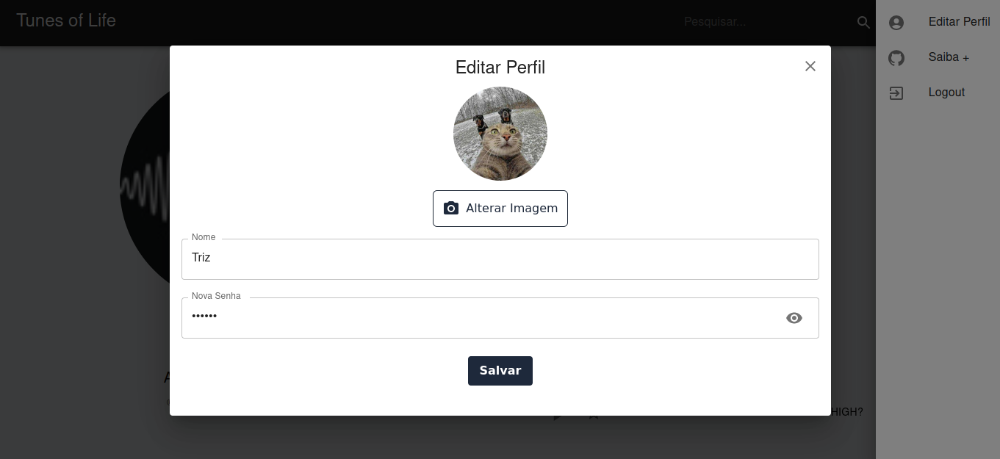

# Tunes of Life

  
<strong>Imagens da Aplicação</strong>

  ## Login
  
  

  ## Tela Principal (Search)
  
  

  ## Tela do Álbum
  
  

  ## Tela de Favoritos
  
  

  ## Componente menu
  
  

  ## Componenrte modal EditProfile
  
  

[Link Deploy](tunes-of-life.vercel.app)

## Visão Geral

Tunes of Life é uma aplicação web construída utilizando Next.js, React e Redux para gerenciar e explorar uma API de músicas. Este projeto está na versão 0.1.0 e atualmente está em desenvolvimento privado.

## Funcionamento da Aplicação

### Header

O header da aplicação está presente em todas as páginas e inclui:

- No lado esquerdo:
  - O nome da aplicação, que ao ser clicado redireciona o usuário para a página principal (/search).
- No bloco do lado direito:
  - Um ícone de lupa, ao ser clicado, abre um campo de busca por nome de artistas.
  - Um ícone de estrela, ao ser clicado, redireciona o usuário para a página de favoritos (/favorites).
  - O nome do usuário.
  - A foto do usuário.
    - Ao clicar no nome ou na foto, é aberto um menu com as opções:
      - Editar perfil: Abre um modal onde o usuário pode trocar o nome, a imagem ou a senha.
      - Saiba mais: Redireciona o usuário para o meu perfil do GitHub.
      - Logout: Apaga os dados do usuário do estado do Redux e redireciona para a página inicial (/login).

### Tela de Login

Na tela de login, os usuários são recebidos com um design intuitivo. A interface inclui:

- Um scroll de imagens com rolagem automática, proporcionando uma experiência visual dinâmica.
- Um formulário de login com validação:
  - O campo de nome deve ter no mínimo 3 letras.
  - A senha deve ter pelo menos 5 caracteres.

Após preencher e enviar o formulário com sucesso, os usuários são redirecionados para a próxima etapa.

### Página de Pesquisa

Na página de pesquisa, os usuários têm acesso a uma variedade de álbuns de artistas aleatórios. O funcionamento desta página é detalhado abaixo:

- Quando a barra de pesquisa está vazia, a aplicação realiza uma busca de artistas por uma letra aleatória, proporcionando descobertas musicais interessantes.
- Os resultados são renderizados na forma de álbuns de artistas, proporcionando uma experiência visual.
- Os usuários têm a capacidade de refinar suas pesquisas usando a barra de pesquisa, explorando assim artistas específicos.

### Página do Álbum

Ao selecionar um álbum na página de pesquisa, os usuários são redirecionados para a página do álbum, acessível através da rota "/album/[id]". A página do álbum inclui:

- No lado esquerdo:
  - A imagem de capa do álbum.
  - O nome do artista.
  - O nome do álbum.
  - O ano de lançamento.

- No lado direito:
  - Uma lista das músicas do álbum.
  - Os usuários podem clicar no ícone de play para escutar um preview da música e pausar clicando no ícone de pause.
  - Também é possivel favoritar as músicas, salvando-as em um estado do Redux.

### Página de Favoritos

A página de favoritos permite aos usuários gerenciar suas músicas favoritas. Nesta página:

- Os usuários podem ver e escutar as músicas salvas no estado do Redux.
- É possível desfavoritar músicas previamente marcadas como favoritas.
- Uma imagem de fractal, inspirada em aplicativos de música antigos, proporciona um visual nostálgico no lado esquerdo da tela.

## Requisitos do Ambiente

Certifique-se de ter instalado em seu computador:

  - [Node.js](https://nodejs.org/docs/latest/api/)
  - npm: Normalmente é instalado automaticamente com o Node.js.
  - [Git](https://git-scm.com/doc)
  - [Next](https://nextjs.org/docs/getting-started/installation)

## Como Começar

1. Clone este repositório.
2. Instale as dependências usando `npm install`.
3. Inicie o servidor de desenvolvimento com `npm run dev`.

## Scripts

- **dev**: Inicia o servidor de desenvolvimento usando `next dev`.
- **export**: Constrói e exporta a aplicação usando `next build` e `next export`.
- **start**: Inicia o servidor de produção usando `next start`.
- **lint**: Executa a análise de código usando o lint do Next.js.
- **build**: Constrói o projeto usando `next build`.
- **start:static**: Serve os arquivos estáticos exportados usando `http-server`.

<strong>Dependências</strong>

### Bibliotecas/Frameworks Principais

- **Next.js**: Um framework React para construir aplicações web com renderização no lado do servidor e estáticas.
- **React**: Uma biblioteca JavaScript para construir interfaces de usuário.
- **Redux**: Um container de estado previsível para aplicações JavaScript.
- **@reduxjs/toolkit**: Conjunto de ferramentas oficial, opinativo e completo para o desenvolvimento eficiente com Redux.
- **React-Redux**: Ligações oficiais do React para o Redux.

### Bibliotecas de Estilização e UI

- **@emotion/react**: Emotion é uma biblioteca popular para escrever estilos com JavaScript.
- **@emotion/styled**: Componentes estilizados para o Emotion.
- **@mui/material**: Biblioteca de componentes React que implementa o Material Design do Google.
- **@mui/icons-material**: Ícones do Material Design para uso com o MUI.

### TypeScript e Tipagens

- **typescript**: Um superset do JavaScript que adiciona tipos estáticos.
- **@types/node**: Definições TypeScript para o Node.js.
- **@types/react**: Definições TypeScript para o React.
- **@types/react-dom**: Definições TypeScript para o React DOM.
- **@types/react-slick**: Definições TypeScript para o carrossel React Slick.
- **@types/react-redux**: Definições TypeScript para o React-Redux.

### Ferramentas de Desenvolvimento

- **eslint**: Uma ferramenta para identificar e relatar padrões no código JavaScript/TypeScript.
- **eslint-config-next**: Configuração do ESLint para projetos Next.js.
- **autoprefixer**: Plugin do PostCSS para analisar CSS e adicionar prefixos de fornecedores.
- **postcss**: Uma ferramenta para transformar estilos com plugins JavaScript.
- **tailwindcss**: Um framework CSS utilitário.
- **http-server**: Um servidor HTTP simples de linha de comando e sem configuração.

Sinta-se à vontade para explorar e contribuir para o projeto Tunes of Life!
